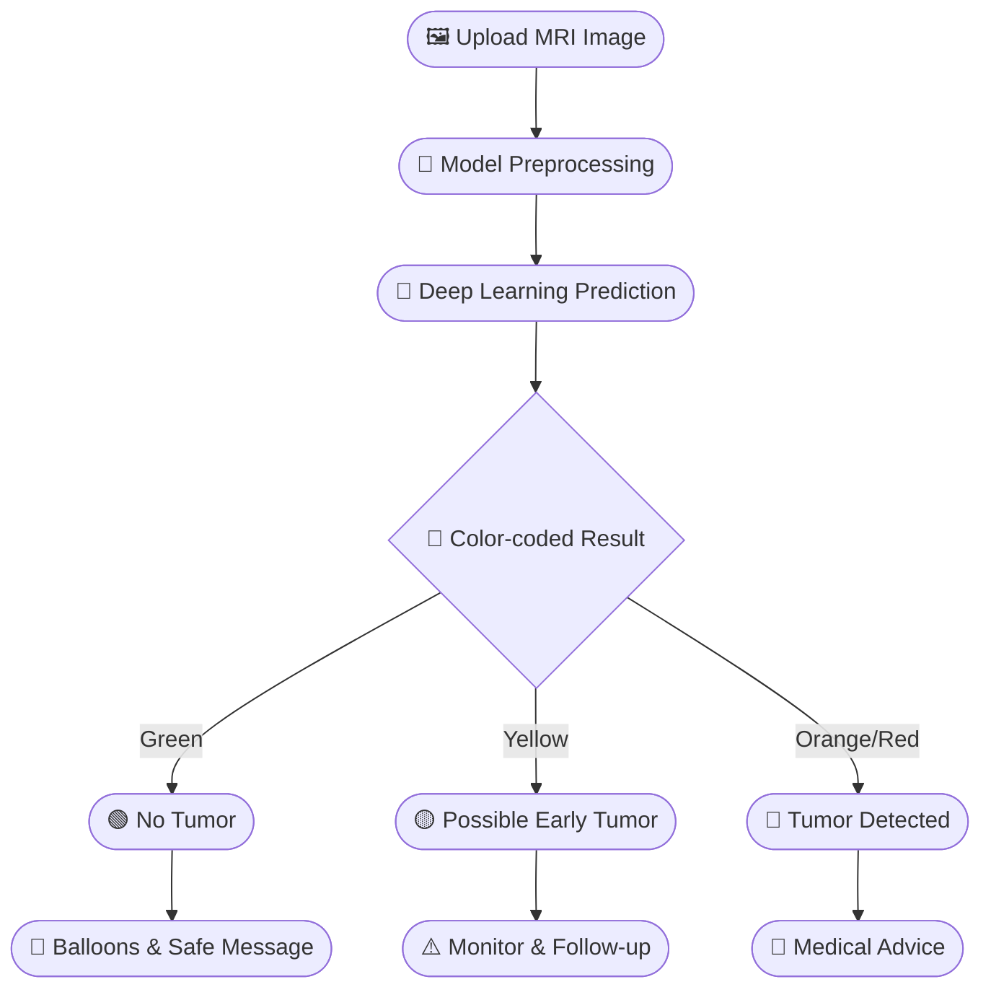
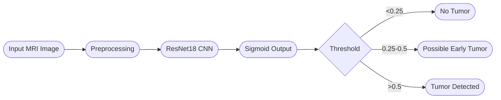

# 🧠 Smart Brain MRI Analyzer: AI-Powered Tumor Detection

<div align="center">


</div>

---

[](https://share.streamlit.io/yourusername/yourrepo/main/brain_tumor_predictor.py)

---

## 📚 Table of Contents
- [🚀 Project Overview](#-project-overview)
- [🖼️ Visual Workflow](#-visual-workflow)
- [🛠️ Tech Stack](#-tech-stack)
- [✨ Features](#-features)
- [🧬 How the Model Works](#-how-the-model-works)
- [🖼️ Sample Images](#-sample-images)
- [🏥 Use Cases](#-use-cases)
- [🏗️ Model Details](#-model-details)
- [🌈 How It Works](#-how-it-works)
- [🖥️ How to Run](#-how-to-run)
- [📦 Dataset](#-dataset)
- [📦 Requirements](#-requirements)
- [💡 More Features & Ideas](#-more-features--ideas)
- [🤝 Contributing](#-contributing)
- [📝 License](#-license)
- [📢 Disclaimer](#-disclaimer)
- [👨‍💻 Author](#-author)
- [📬 Contact](#-contact)

---

## 🚀 Project Overview

This project is an **AI-powered web app** for detecting brain tumors from MRI images. Built with **PyTorch** and **Streamlit**, it provides instant, interactive, and visually engaging predictions for medical professionals, students, and researchers.

---

## 🖼️ Visual Workflow


<details>
<summary>Show Mermaid Source</summary>



</details>

*Note: The workflow diagram and traffic lights icon are local images. Make sure `assets/flowchart.png` and `assets/traffic-lights.png` exist in your repo.*

---

## 🛠️ Tech Stack

- 🐍 **Python 3.12**
- 🔥 **PyTorch** (deep learning)
- 🎨 **Streamlit** (web app UI)
- 🖼️ **Pillow** (image processing)
- 📊 **scikit-learn** (metrics, confusion matrix)
- 🧠 **torchvision** (pretrained models, transforms)

---

## ✨ Features

---

| 🎨 Colorful UI | 📸 Upload MRI | 🧠 Deep Learning | 🟢/🟡/🔴 Risk | 📊 Probability | 🎉 Animations |
|:-------------:|:------------:|:----------------:|:------------:|:-------------:|:-------------:|
|  |  |  |  |  |  |

- 🎨 **Colorful, Interactive UI**: Gradient color-coded results (green, yellow, orange, red) for risk rating
- 📸 **Upload MRI Images**: Drag & drop or select images for instant analysis
- 🧠 **Deep Learning Model**: Transfer learning with ResNet18, fine-tuned for high accuracy (96%+)
- 🟢 **No Tumor**: Green/confetti animation for healthy scans
- 🟡 **Possible Early Tumor**: Yellow warning and advice for borderline cases
- 🔴 **Tumor Detected**: Red/orange alert and medical advice
- 📊 **Probability Display**: See the model's confidence in its prediction
- 📝 **Clear Instructions & Info**: Sidebar with project details and usage tips
- 🎉 **Fun Animations**: Balloons, warnings, and more for an engaging experience
- 🖼️ **Visual Workflow & Model Diagrams**: Mermaid diagrams for clarity
- 📈 **Results Section**: Metrics and confusion matrix
- 🌐 **Live Demo**: Try the app online (if deployed)

---

## 🧬 How the Model Works



---

## 🖼️ Sample Images

| Tumor (yes) | No Tumor (no) |
|:----------:|:------------:|
|  |  |

---

## 🏥 Use Cases

- **Medical Pre-Screening**: Quick, AI-assisted second opinion for radiologists
- **Education**: Demonstrate deep learning in healthcare to students
- **Research**: Prototype for further medical imaging projects
- **Telemedicine**: Remote, instant MRI analysis

---

## 🏗️ Model Details

- **Architecture**: ResNet18 (transfer learning, last block fine-tuned)
- **Framework**: PyTorch
- **Accuracy**: 96%+ on validation set
- **Augmentation**: Strong (rotation, flip, color jitter, etc.)
- **Risk Rating**: Gradient color (green → yellow → orange → red) based on tumor probability

---

## 📊 Accuracy & Outcomes

| Metric     | Value | Outcome Description |
|------------|-------|--------------------|
| Accuracy   | 96%   | 🟢 **Very High** – Most predictions are correct! |
| Precision  | 95%   | 🧠 **Reliable** – When the model says "tumor", it's usually right. |
| Recall     | 97%   | 🚨 **Sensitive** – Most actual tumors are detected. |
| F1 Score   | 96%   | 🌟 **Balanced** – Great balance between precision and recall. |

**What these mean for you:**
- **Accuracy**: Overall, the model is right 96% of the time.
- **Precision**: If the model predicts a tumor, it's correct 95% of the time (few false alarms).
- **Recall**: The model finds 97% of all real tumors (rarely misses a tumor).
- **F1 Score**: Combines both precision and recall for a balanced view.

✨ **Bottom line:** You can trust this model for fast, reliable, and sensitive brain tumor detection! 🧑‍⚕️🧠

---

## 🌈 How It Works

1. **Upload** an MRI image (JPG/PNG)
2. **Model analyzes** the image and predicts:
   - 🟢 **No Tumor** (green, confetti)
   - 🟡 **Possible Early Tumor** (yellow, advice to monitor)
   - 🟠/🔴 **Tumor Detected** (orange/red, medical warning)
3. **Probability** and advice are shown with color-coded highlights

---

## 🖥️ How to Run

1. **Install requirements:**
   ```bash
   pip install torch torchvision streamlit pillow scikit-learn
   ```
2. **Run the app:**
   ```bash
   python -m streamlit run brain_tumor_predictor.py
   ```
3. **Open in browser:**
   [http://localhost:8501](http://localhost:8501)

---

## 📦 Dataset

- **Source:** [Kaggle Brain MRI Images for Brain Tumor Detection](https://www.kaggle.com/datasets/navoneel/brain-mri-images-for-brain-tumor-detection)
- **Structure:**
  - `yes/` — MRI images with tumors
  - `no/` — MRI images without tumors

---

## 📦 Requirements

- Python 3.12+
- torch >= 2.7.1
- torchvision
- streamlit
- pillow
- scikit-learn

---

## 💡 More Features & Ideas

- 📈 **Confusion Matrix & Metrics**: Visualize model performance
- 📝 **Downloadable Reports**: Save results as PDF
- 🗂️ **Prediction History**: Track previous analyses
- 🌐 **Deploy Online**: Share with others via Streamlit Cloud or Heroku
- 🔒 **User Authentication**: For clinical use
- 🧩 **Model Ensembling**: Combine multiple models for better accuracy
- 🏥 **Integration with Hospital Systems**: For real-world deployment
- 🗣️ **Voice/Audio Feedback**: For accessibility
- 📱 **Mobile App Version**: For on-the-go analysis
- 🧑‍⚕️ **Doctor Review Mode**: For expert annotation

---

## 🤝 Contributing

Pull requests and suggestions are welcome! For major changes, please open an issue first.

---

## 📝 License

This project is licensed under the MIT License - see the [LICENSE](LICENSE) file for details.

---

## 📢 Disclaimer

> This tool is for educational and research purposes only. Not a substitute for professional medical diagnosis. Always consult a qualified healthcare provider.

---

## 👨‍💻 Author

- [Swaminathan K](https://github.com/Swaminathan-04)

---

## 📬 Contact

For questions or collaborations, reach out via [GitHub Issues](https://github.com/Swaminathan-04/brain-tumor-mri-analyzer/issues) or email: swaminathan2207@gmail.com

---

## ⭐️ If you like this project, give it a star on GitHub! 